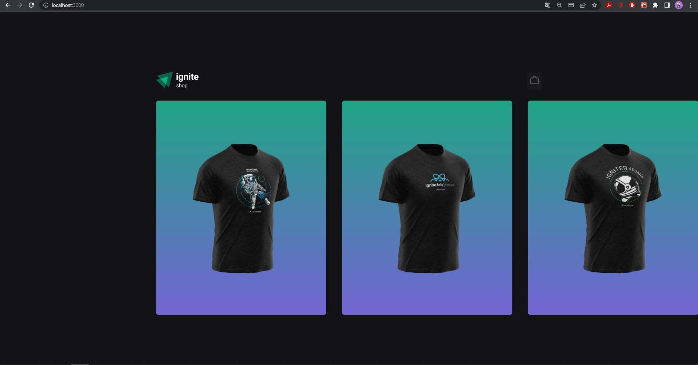
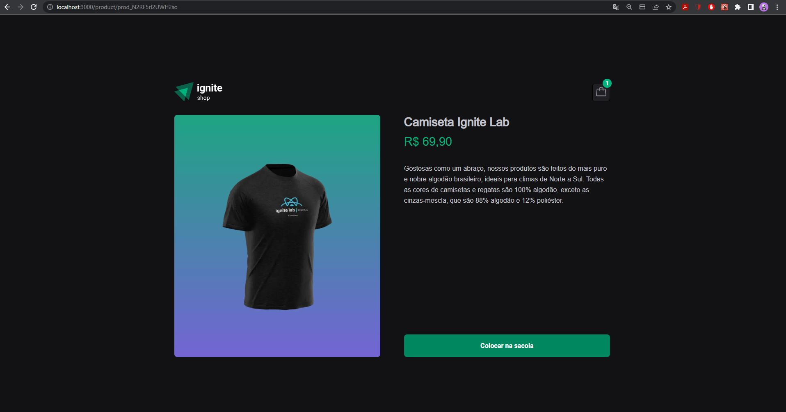
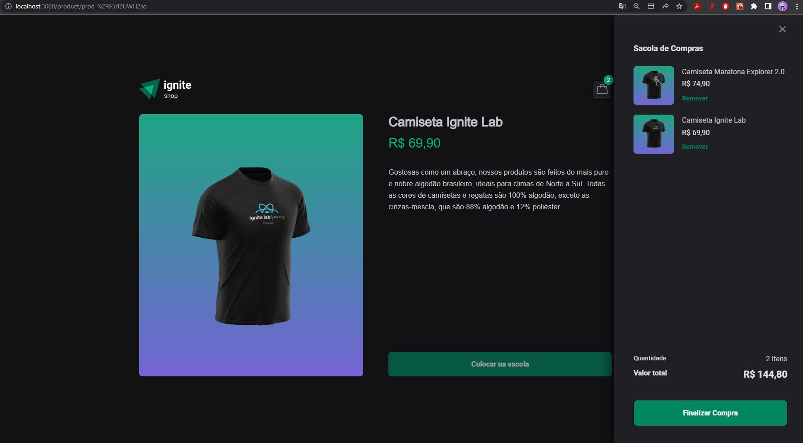

## :bookmark_tabs: Desafio
Este desafio é referente a trilha atualizada do ReactJS do IGNITE e tem como objetivo aproveitar a aplicação desenvolvida na trilha para implementar um carrinho que utilizará os dados da API Stripe para buscar e controlar os itens existentes e adicionar as seguintes funcionalidades:

  - Adiconar o item na sacola
  - Exibir os itens na sacola
  - Mostrar todos os itens comprados na página de sucesso
  
 ## Tecnologias
 
  - [NextJS](https://nextjs.org/docs)
  - [Stitches](https://stitches.dev/)
  - [Radix-UI](https://www.radix-ui.com/)
  - [keen-slider](https://keen-slider.io/)
  - [Stripe](https://stripe.com/docs/api)
  
 ## :sparkler: Aplicação
 
 
 
 
